# Measurement Data – 25 F Supercapacitors

This folder contains measurement data, results and related files for supercapacitor discharge tests using 25 F units from six different manufacturers. 

## Contents

- [Dataset Overview](#dataset-overview)
- [Discharge Curve Gallery](#discharge-curve-gallery)

- [Important Notes](#important-notes)
- [Related Links](#related-links)

## Dataset Overview

This dataset (Multi-Manufacturer Set) includes six manufacturers, each represented by three 25 F devices from the same batch to ensure statistical consistency:

- Eaton
- Kyocera
- Maxwell
- Sech
- Vishay
- Würth Elektronik

Each device was tested at three discharge current levels (IEC 62391-1 Method 1A Classes 2, 3, and 4) representing progressively increasing current conditions. For detailed information about the experimental setup and measurement procedures, see the [Main Repository README](../README.md#experimental-setup-and-methodology).

## Discharge Curve Gallery

Number of manufacturers: 6

### Table of Contents

- [Eaton](#eaton)
- [Kyocera](#kyocera)
- [Maxwell](#maxwell)
- [Sech](#sech)
- [Vishay](#vishay)
- [Würth Elektronik](#würth-elektronik)

---

## Eaton

**Number of Images:** 3

### Image 1: Eaton_25F_C_A2.png

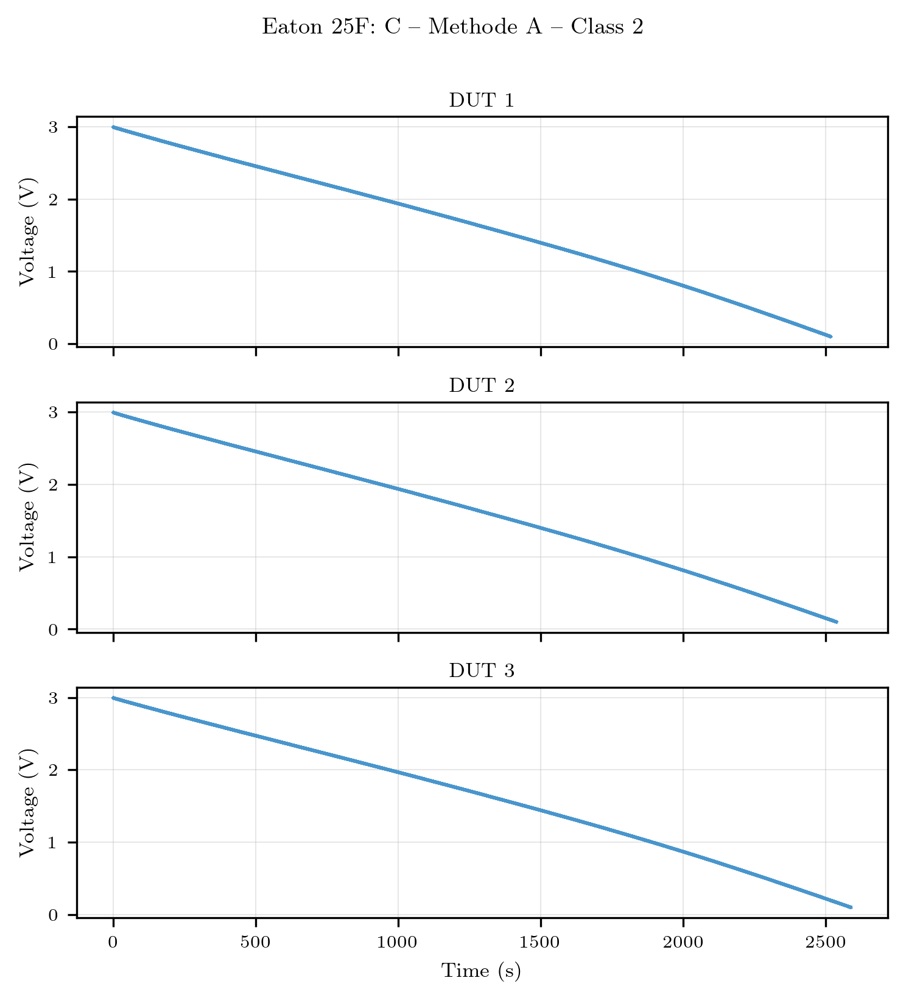

**Manufacturer:** `Eaton`

**Capacitance:** `25F`

**Path:** `Eaton_25F_C_A2.png`
* [Eaton: 25F, Methode A Class 2 DUT 1](./Eaton/C_A2_DUT1_V2_Eaton_25F_cut.csv)
* [Eaton: 25F, Methode A Class 2 DUT 2](./Eaton/C_A2_DUT2_V2_Eaton_25F_cut.csv)
* [Eaton: 25F, Methode A Class 2 DUT 3](./Eaton/C_A2_DUT3_V2_Eaton_25F_cut.csv)
---

### Image 2: Eaton_25F_C_A3.png

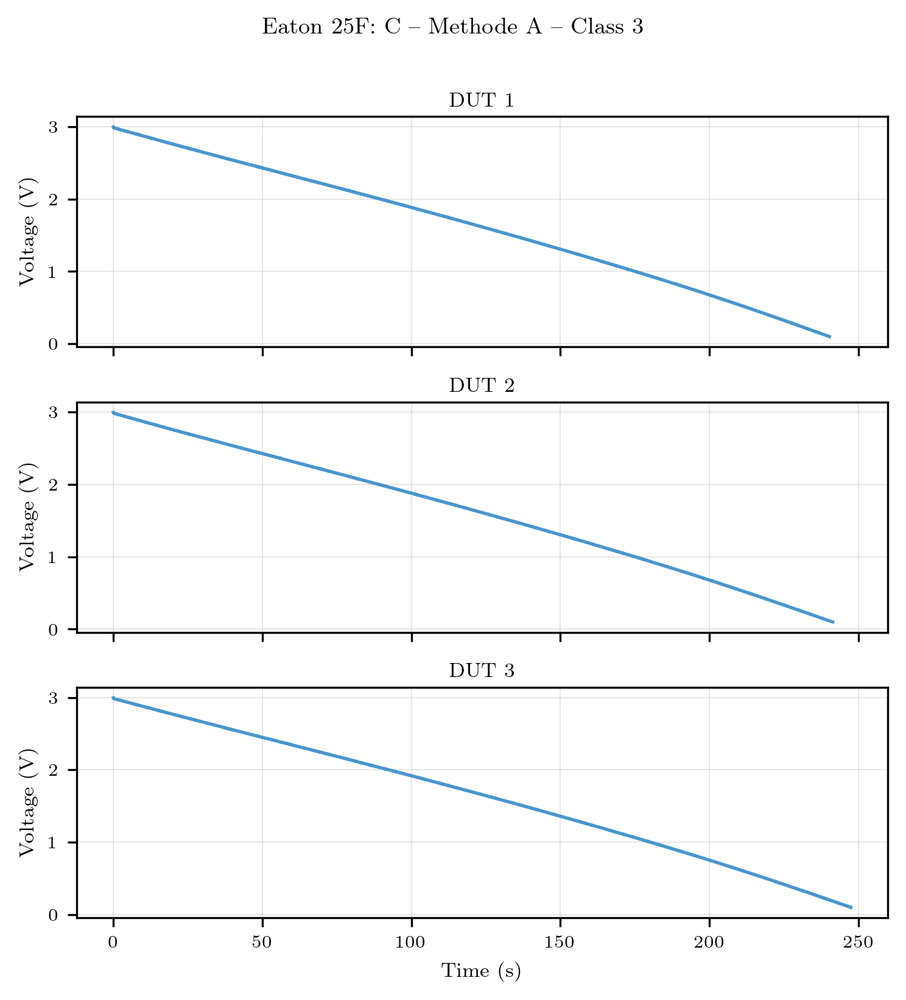

**Manufacturer:** `Eaton`

**Capacitance:** `25F`

**Path:** `Eaton_25F_C_A3.png`
* [Eaton: 25F, Methode A Class 3 DUT 1](./Eaton/C_A3_DUT1_V2_Eaton_25F_cut.csv)
* [Eaton: 25F, Methode A Class 3 DUT 2](./Eaton/C_A3_DUT2_V2_Eaton_25F_cut.csv)
* [Eaton: 25F, Methode A Class 3 DUT 3](./Eaton/C_A3_DUT3_V2_Eaton_25F_cut.csv)
---

### Image 3: Eaton_25F_C_A4.png

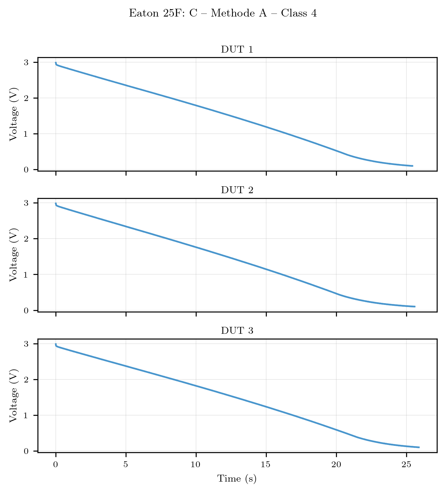

**Manufacturer:** `Eaton`

**Capacitance:** `25F`

**Path:** `Eaton_25F_C_A4.png`
* [Eaton: 25F, Methode A Class 4 DUT 1](./Eaton/C_A4_DUT1_V1_EATON_25F_cut.csv)
* [Eaton: 25F, Methode A Class 4 DUT 2](./Eaton/C_A4_DUT2_V1_EATON_25F_cut.csv)
* [Eaton: 25F, Methode A Class 4 DUT 3](./Eaton/C_A4_DUT3_V1_EATON_25F_cut.csv)
---

## Kyocera

**Number of Images:** 3

### Image 1: Kyocera_25F_C_A2.png

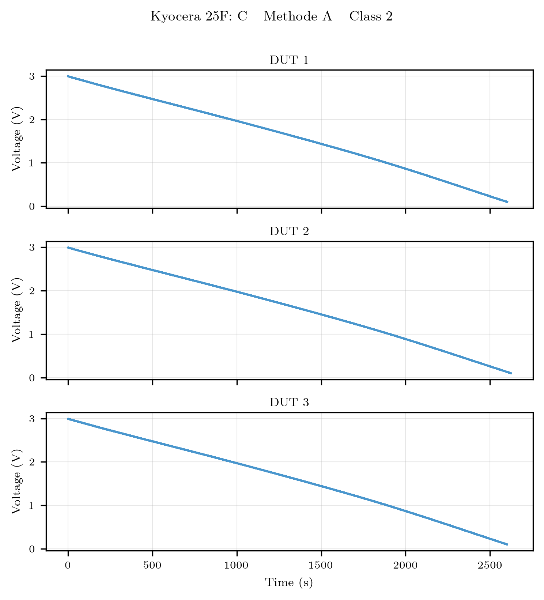

**Manufacturer:** `Kyocera`

**Capacitance:** `25F`

**Path:** `Kyocera_25F_C_A2.png`
* [Kyocera: 25F, Methode A Class 2 DUT 1](./Kyocera/C_A2_DUT1_V2_Kyocera_25F_cut.csv)
* [Kyocera: 25F, Methode A Class 2 DUT 2](./Kyocera/C_A2_DUT2_V2_Kyocera_25F_cut.csv)
* [Kyocera: 25F, Methode A Class 2 DUT 3](./Kyocera/C_A2_DUT3_V2_Kyocera_25F_cut.csv)
---

### Image 2: Kyocera_25F_C_A3.png

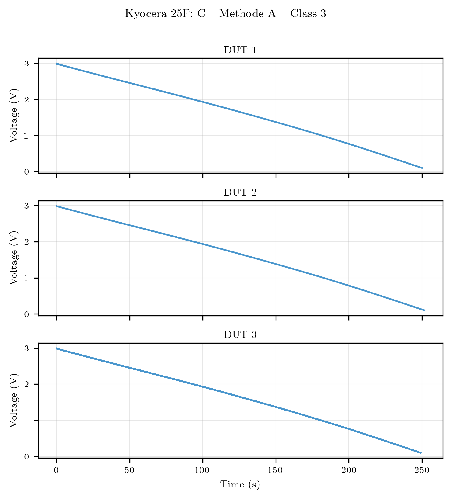

**Manufacturer:** `Kyocera`

**Capacitance:** `25F`

**Path:** `Kyocera_25F_C_A3.png`
* [Kyocera: 25F, Methode A Class 3 DUT 1](./Kyocera/C_A3_DUT1_V2_Kyocera_25F_cut.csv)
* [Kyocera: 25F, Methode A Class 3 DUT 2](./Kyocera/C_A3_DUT2_V2_Kyocera_25F_cut.csv)
* [Kyocera: 25F, Methode A Class 3 DUT 3](./Kyocera/C_A3_DUT3_V2_Kyocera_25F_cut.csv)
---

### Image 3: Kyocera_25F_C_A4.png

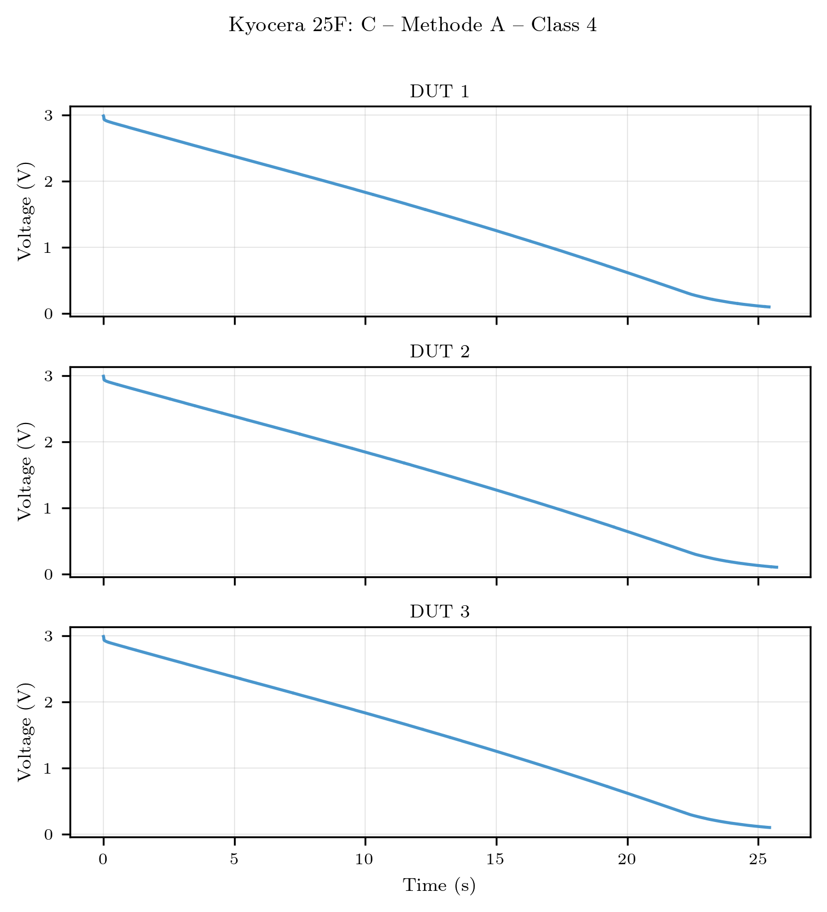

**Manufacturer:** `Kyocera`

**Capacitance:** `25F`

**Path:** `Kyocera_25F_C_A4.png`
* [Kyocera: 25F, Methode A Class 4 DUT 1](./Kyocera/C_A4_DUT1_V1_Kyocera_25F_cut.csv)
* [Kyocera: 25F, Methode A Class 4 DUT 2](./Kyocera/C_A4_DUT2_V1_Kyocera_25F_cut.csv)
* [Kyocera: 25F, Methode A Class 4 DUT 3](./Kyocera/C_A4_DUT3_V1_Kyocera_25F_cut.csv)
---

## Maxwell

**Number of Images:** 3

### Image 1: Maxwell_25F_C_A2.png

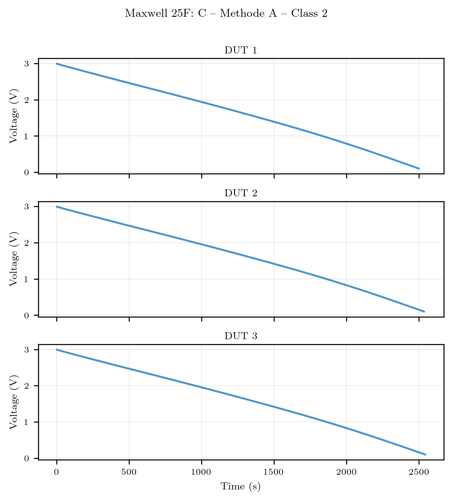

**Manufacturer:** `Maxwell`

**Capacitance:** `25F`

**Path:** `Maxwell_25F_C_A2.png`
* [Maxwell: 25F, Methode A Class 2 DUT 1](./Maxwell/C_A2_DUT1_V2_Maxwell_25F_cut.csv)
* [Maxwell: 25F, Methode A Class 2 DUT 2](./Maxwell/C_A2_DUT2_V2_Maxwell_25F_cut.csv)
* [Maxwell: 25F, Methode A Class 2 DUT 3](./Maxwell/C_A2_DUT3_V2_Maxwell_25F_cut.csv)
---

### Image 2: Maxwell_25F_C_A3.png

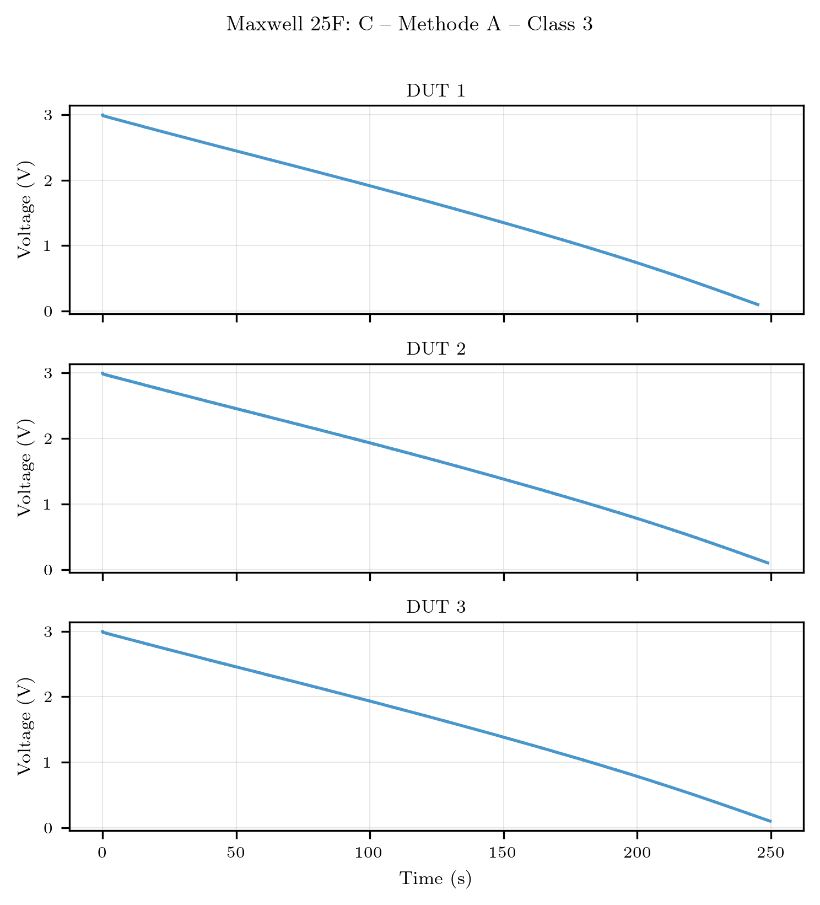

**Manufacturer:** `Maxwell`

**Capacitance:** `25F`

**Path:** `Maxwell_25F_C_A3.png`
* [Maxwell: 25F, Methode A Class 3 DUT 1](./Maxwell/C_A3_DUT1_V2_Maxwell_25F_cut.csv)
* [Maxwell: 25F, Methode A Class 3 DUT 2](./Maxwell/C_A3_DUT2_V2_Maxwell_25F_cut.csv)
* [Maxwell: 25F, Methode A Class 3 DUT 3](./Maxwell/C_A3_DUT3_V2_Maxwell_25F_cut.csv)
---

### Image 3: Maxwell_25F_C_A4.png

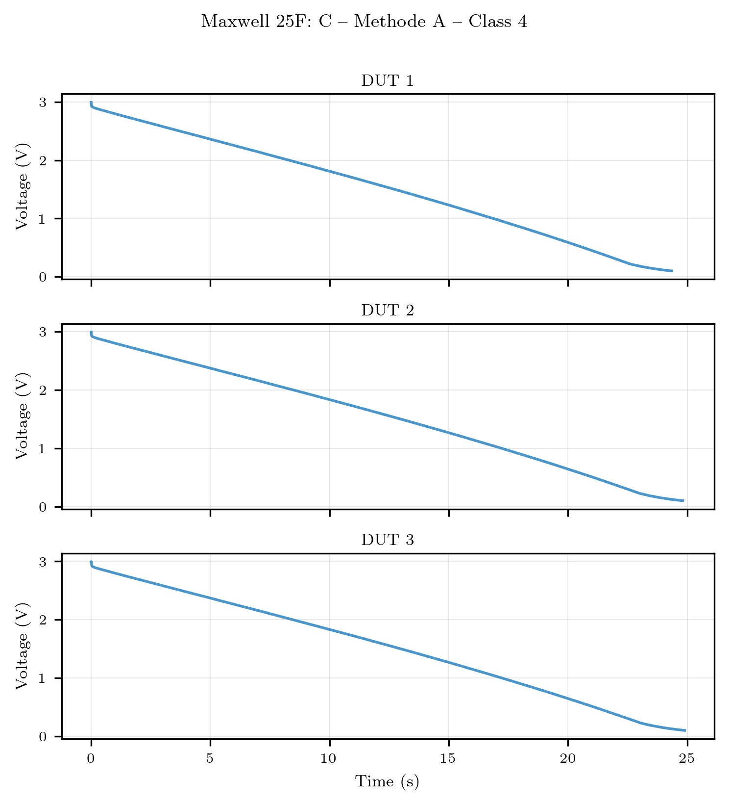

**Manufacturer:** `Maxwell`

**Capacitance:** `25F`

**Path:** `Maxwell_25F_C_A4.png`
* [Maxwell: 25F, Methode A Class 4 DUT 1](./Maxwell/C_A4_DUT1_V1_Maxwell_25F_cut.csv)
* [Maxwell: 25F, Methode A Class 4 DUT 2](./Maxwell/C_A4_DUT2_V1_Maxwell_25F_cut.csv)
* [Maxwell: 25F, Methode A Class 4 DUT 3](./Maxwell/C_A4_DUT3_V1_Maxwell_25F_cut.csv)
---

## Sech

**Number of Images:** 3

### Image 1: Sech_25F_C_A2.png

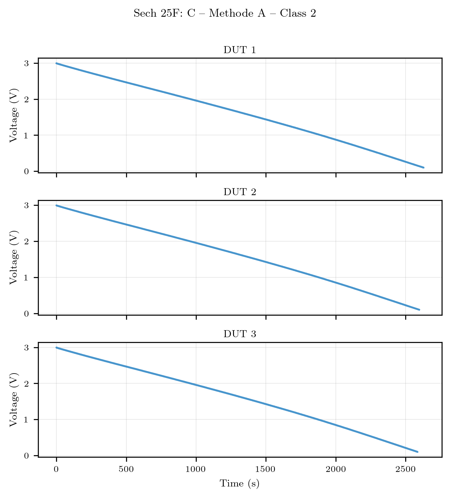

**Manufacturer:** `Sech`

**Capacitance:** `25F`

**Path:** `Sech_25F_C_A2.png`
* [Sech: 25F, Methode A Class 2 DUT 1](./Sech/C_A2_DUT1_V2_Sech_25F_cut.csv)
* [Sech: 25F, Methode A Class 2 DUT 2](./Sech/C_A2_DUT2_V2_Sech_25F_cut.csv)
* [Sech: 25F, Methode A Class 2 DUT 3](./Sech/C_A2_DUT3_V2_Sech_25F_cut.csv)
---

### Image 2: Sech_25F_C_A3.png

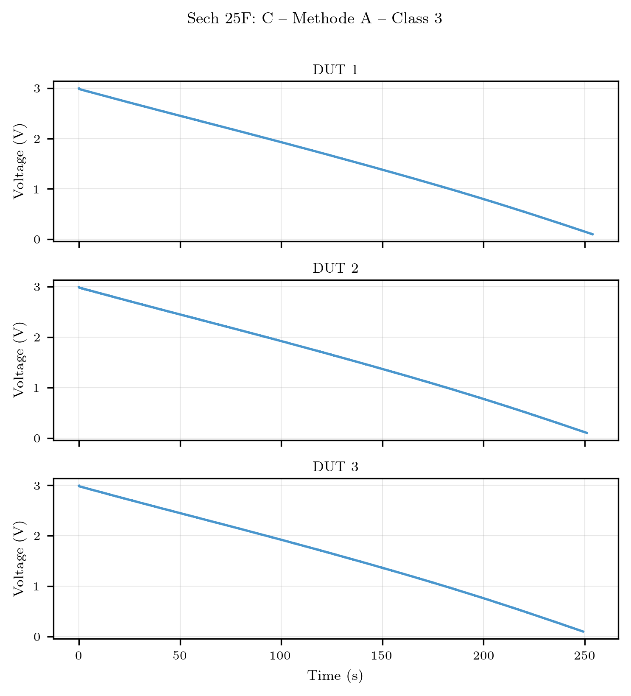

**Manufacturer:** `Sech`

**Capacitance:** `25F`

**Path:** `Sech_25F_C_A3.png`
* [Sech: 25F, Methode A Class 3 DUT 1](./Sech/C_A3_DUT1_V2_Sech_25F_cut.csv)
* [Sech: 25F, Methode A Class 3 DUT 2](./Sech/C_A3_DUT2_V2_Sech_25F_cut.csv)
* [Sech: 25F, Methode A Class 3 DUT 3](./Sech/C_A3_DUT3_V2_Sech_25F_cut.csv)
---

### Image 3: Sech_25F_C_A4_.png

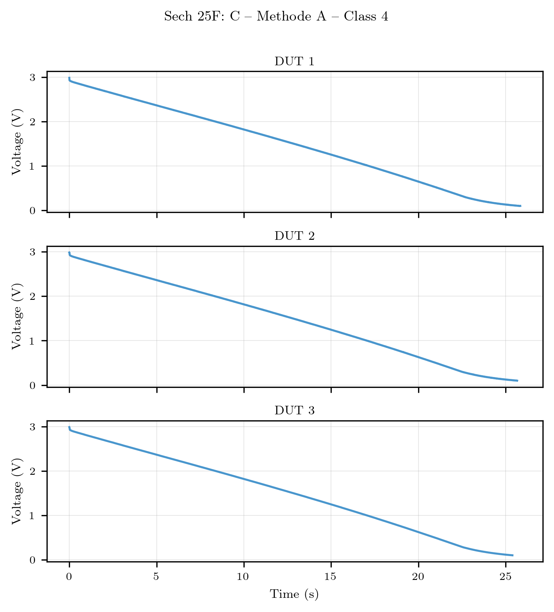

**Manufacturer:** `Sech`

**Capacitance:** `25F`

**Path:** `Sech_25F_C_A4_.png`
* [Sech: 25F, Methode A Class 4 DUT 1](./Sech/C_A4_DUT1_V1_SECH_25F_cut.csv)
* [Sech: 25F, Methode A Class 4 DUT 2](./Sech/C_A4_DUT2_V1_SECH_25F_cut.csv)
* [Sech: 25F, Methode A Class 4 DUT 3](./Sech/C_A4_DUT3_V1_SECH_25F_cut.csv)
---

## Vishay

**Number of Images:** 3

### Image 1: Vishay_25F_C_A2.png

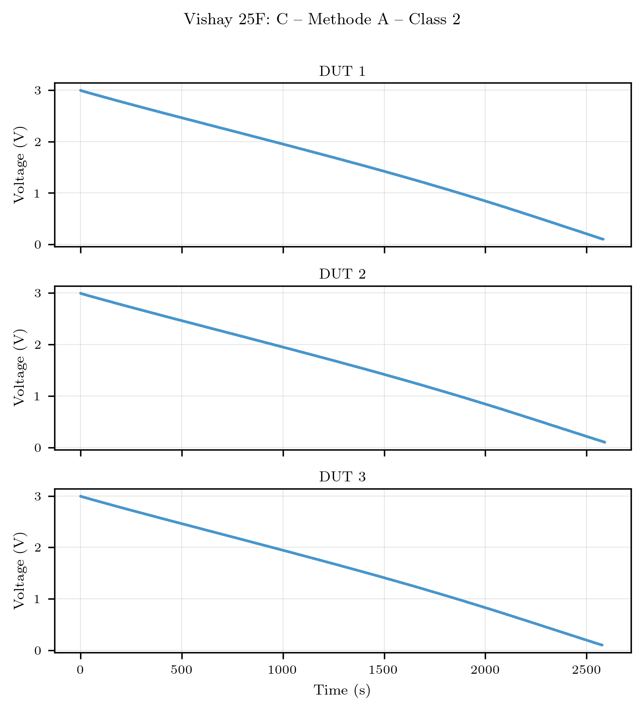

**Manufacturer:** `Vishay`

**Capacitance:** `25F`

**Path:** `Vishay_25F_C_A2.png`
* [Vishay: 25F, Methode A Class 2 DUT 1](./Vishay/C_A2_DUT1_V2_Vishay_25F_cut.csv)
* [Vishay: 25F, Methode A Class 2 DUT 2](./Vishay/C_A2_DUT2_V2_Vishay_25F_cut.csv)
* [Vishay: 25F, Methode A Class 2 DUT 3](./Vishay/C_A2_DUT3_V2_Vishay_25F_cut.csv)
---

### Image 2: Vishay_25F_C_A3.png

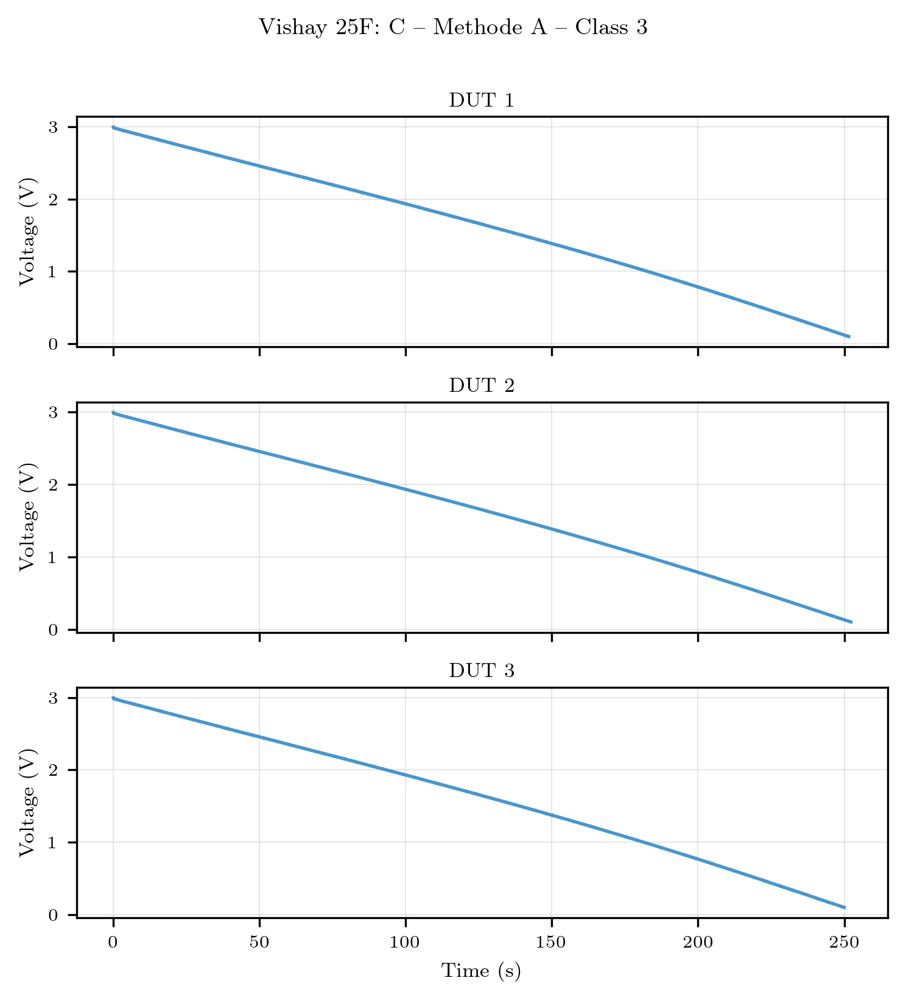

**Manufacturer:** `Vishay`

**Capacitance:** `25F`

**Path:** `Vishay_25F_C_A3.png`
* [Vishay: 25F, Methode A Class 3 DUT 1](./Vishay/C_A3_DUT1_V2_Vishay_25F_cut.csv)
* [Vishay: 25F, Methode A Class 3 DUT 2](./Vishay/C_A3_DUT2_V2_Vishay_25F_cut.csv)
* [Vishay: 25F, Methode A Class 3 DUT 3](./Vishay/C_A3_DUT3_V2_Vishay_25F_cut.csv)
---

### Image 3: Vishay_25F_C_A4.png

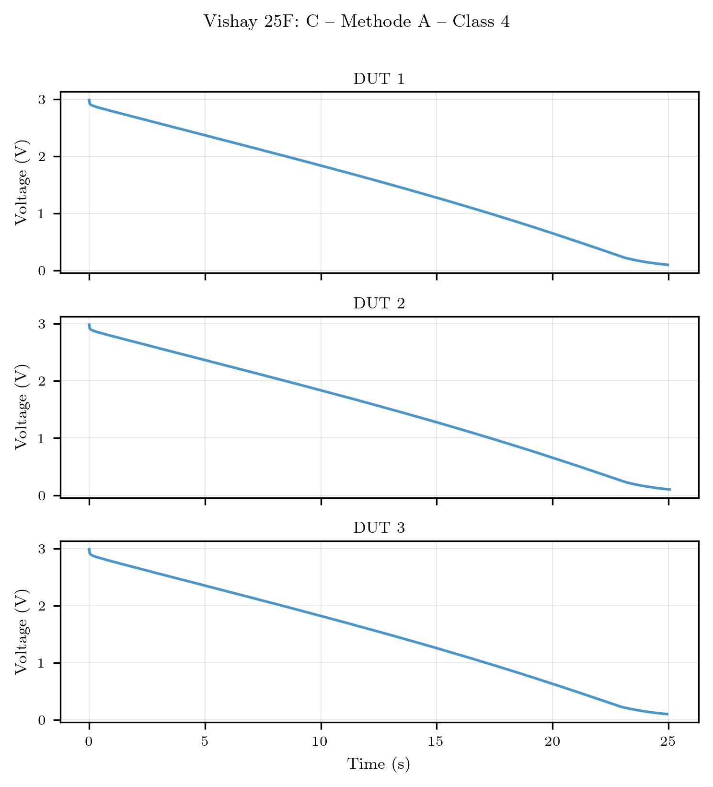

**Manufacturer:** `Vishay`

**Capacitance:** `25F`

**Path:** `Vishay_25F_C_A4.png`
* [Vishay: 25F, Methode A Class 4 DUT 1](./Vishay/C_A4_DUT1_V1_Vishay_25F_cut.csv)
* [Vishay: 25F, Methode A Class 4 DUT 2](./Vishay/C_A4_DUT2_V1_Vishay_25F_cut.csv)
* [Vishay: 25F, Methode A Class 4 DUT 3](./Vishay/C_A4_DUT3_V1_Vishay_25F_cut.csv)
---

## WürthElektronik

**Number of Images:** 3

### Image 1: WürthElektronik_25F_C_A2.png

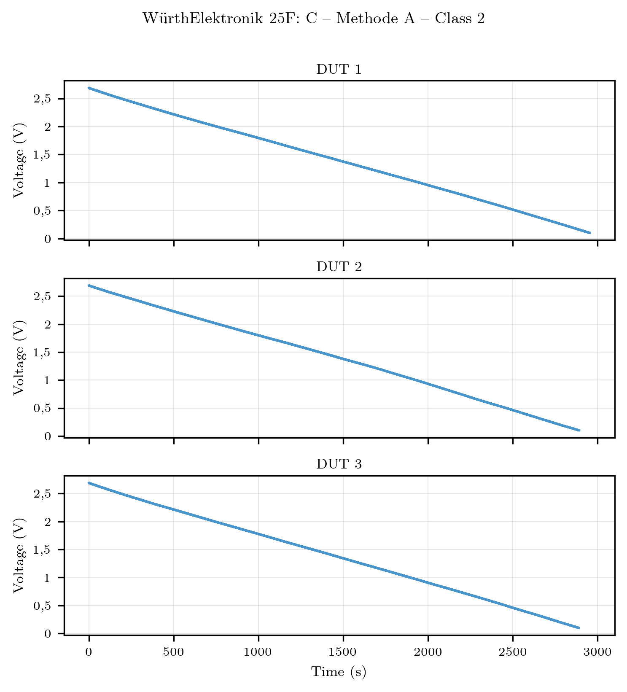

**Manufacturer:** `WürthElektronik`

**Capacitance:** `25F`

**Path:** `WürthElektronik_25F_C_A2.png`
* [Würth Elektronik: 25F, Methode A Class 2 DUT 1](./WürthElektronik/C_A2_DUT1_V2_WuerthElektronik_25F_cut.csv)
* [Würth Elektronik: 25F, Methode A Class 2 DUT 2](./WürthElektronik/C_A2_DUT2_V2_WuerthElektronik_25F_cut.csv)
* [Würth Elektronik: 25F, Methode A Class 2 DUT 3](./WürthElektronik/C_A2_DUT3_V2_WuerthElektronik_25F_cut.csv)
---

### Image 2: WürthElektronik_25F_C_A3.png

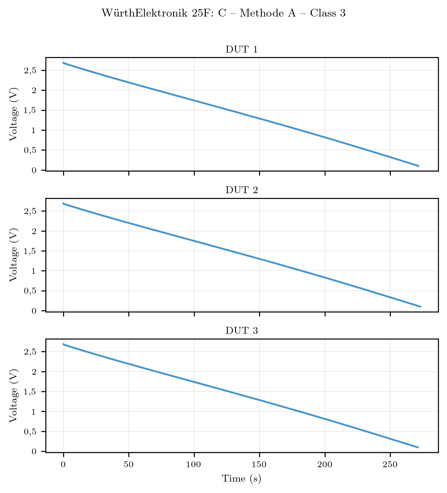

**Manufacturer:** `WürthElektronik`

**Capacitance:** `25F`

**Path:** `WürthElektronik_25F_C_A3.png`
* [Würth Elektronik: 25F, Methode A Class 3 DUT 1](./WürthElektronik/C_A3_DUT1_V2_WuerthElektronik_25F_cut.csv)
* [Würth Elektronik: 25F, Methode A Class 3 DUT 2](./WürthElektronik/C_A3_DUT2_V2_WuerthElektronik_25F_cut.csv)
* [Würth Elektronik: 25F, Methode A Class 3 DUT 3](./WürthElektronik/C_A3_DUT3_V2_WuerthElektronik_25F_cut.csv)
---

### Image 3: WürthElektronik_25F_C_A4.png

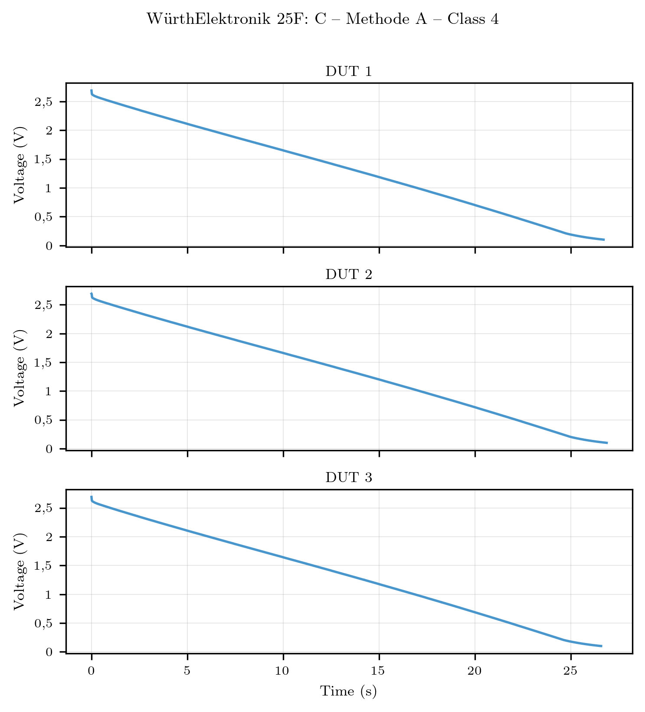

**Manufacturer:** `WürthElektronik`

**Capacitance:** `25F`

**Path:** `WürthElektronik_25F_C_A4.png`
* [Würth Elektronik: 25F, Methode A Class 4 DUT 1](./WürthElektronik/C_A4_DUT1_V1_WuerthElektronik_25F_cut.csv)
* [Würth Elektronik: 25F, Methode A Class 4 DUT 2](./WürthElektronik/C_A4_DUT2_V1_WuerthElektronik_25F_cut.csv)
* [Würth Elektronik: 25F, Methode A Class 4 DUT 3](./WürthElektronik/C_A4_DUT3_V1_WuerthElektronik_25F_cut.csv)
---

## Important Notes

- Contact for questions: Andreas.Hanschek@uibk.ac.at

## Related Links

- [Main Repository README](../README.md) - Includes experimental setup and methodology
- [50 F Measurements](../50F/README.md)
