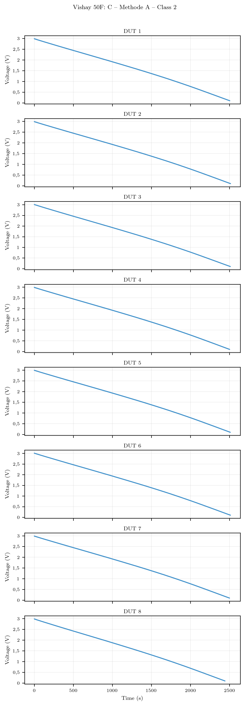
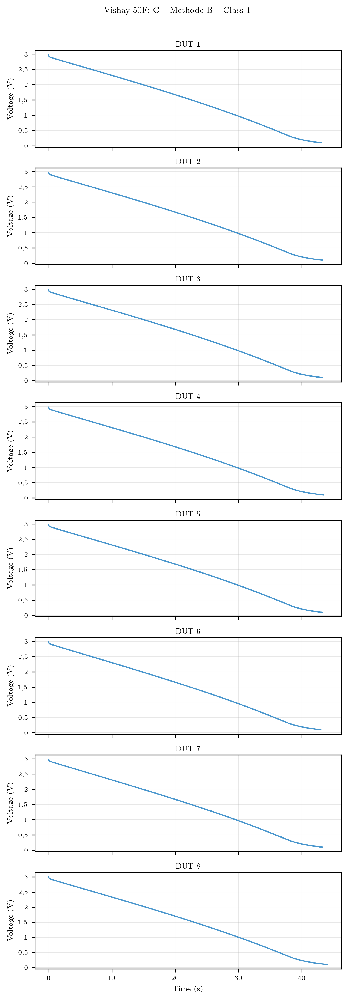

# Measurement Data – 50 F Supercapacitors

This folder contains measurement data, results and related files for supercapacitor discharge tests using 50 F units (Vishay manufacturer). Only preview/example files that are safe to share publicly should be placed here. Do not upload full raw datasets or sensitive files.

## Contents

- [Dataset Overview](#dataset-overview)
- [Discharge Curve Gallery](#discharge-curve-gallery)
- [Data Structure](#data-structure)
- [Important Notes](#important-notes)
- [Related Links](#related-links)

## Dataset Overview

This dataset (Validation Set) includes eight 50 F, 3.0 V EDLCs from Vishay, all from the same production batch to ensure uniformity and to quantify consistency and variation within a single batch.

The tests were conducted according to IEC 62391-1 using three discharge currents:
- Method 1A Class current (Class 2, 0.06 A)
- ESR current (ESR Class 2 / C Class 3, 0.60 A)  
- Method 1B high-current discharge (3.41 A, corresponding to 95% efficiency criterion)

Each DUT was tested under all three conditions, resulting in 24 discharge curves total. For detailed information about the experimental setup and measurement procedures, see the [Main Repository README](../README.md#experimental-setup-and-methodology).

## Discharge Curve Gallery

Number of manufacturers: 1

### Table of Contents

- [Vishay](#vishay)

---
## Vishay

**Number of Images:** 3

### Image 1: Vishay_50F_C_A2.png

**Manufacturer:** `Vishay`

**Capacitance:** `50F`

**Path:** `Vishay_50F_C_A2.png`

---

### Image 2: Vishay_50F_C_A3.png

**Manufacturer:** `Vishay`

**Capacitance:** `50F`

**Path:** `Vishay_50F_C_A3.png`

---

### Image 3: Vishay_50F_C_B1.png

**Manufacturer:** `Vishay`

**Capacitance:** `50F`

**Path:** `Vishay_50F_C_B1.png`

---

## Important Notes

- This repository/folder contains only preview material intended for reviewers and readers as supplementary material.
- Full datasets and the full analysis code remain private until the associated manuscript is accepted.
- Replace example files with the final public artifacts only after acceptance, or provide them under an explicit embargo controlled through Zenodo or a similar repository.
- Contact for questions: Hnandreas (GitHub)

## Related Links

- [Main Repository README](../README.md) - Includes experimental setup and methodology
- [DISCLAIMER](../DISCLAIMER.md) - Important usage and distribution information
- [25 F Measurements](../25F/README.md)
