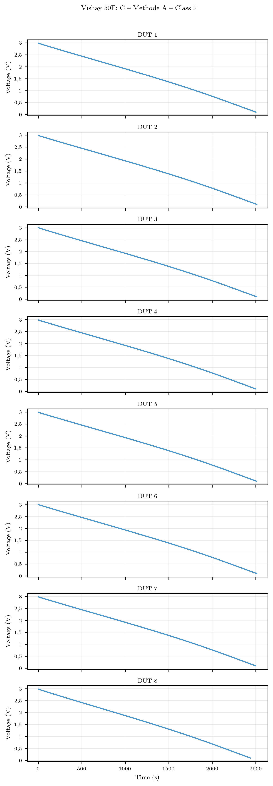
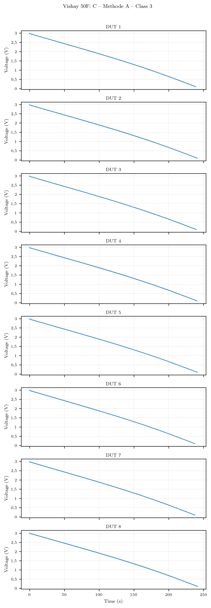
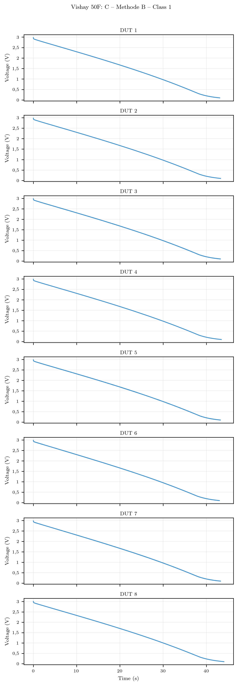

# Measurement Data – 50 F Supercapacitors

This folder contains measurement data, results and related files for supercapacitor discharge tests using 50 F units (Manufacturer: Vishay). 
## Contents

- [Dataset Overview](#dataset-overview)
- [Discharge Curve Gallery](#discharge-curve-gallery)
- [Important Notes](#important-notes)
- [Related Links](#related-links)

## Dataset Overview

This dataset (Validation Set) includes eight 50 F, 3.0 V EDLCs from Vishay, all from the same batch to ensure uniformity and to quantify consistency and variation within a single batch.

The tests were conducted according to IEC 62391-1 using three discharge currents:
- Method 1A Class 2 0.06 A
- Method 1A Class 3 0.06 A 
- Method 1B Class 3-4-5: 3.41 A (corresponding to 95% efficiency criterion)

Each DUT was tested under all three conditions, resulting in 24 discharge curves total. For detailed information about the experimental setup and measurement procedures, see the [Main Repository README](../README.md#experimental-setup-and-methodology).

## Discharge Curve Gallery

Number of manufacturers: 1

### Table of Contents

- [Vishay](#vishay)

---
## Vishay

**Number of Images:** 3

### Image 1: Vishay_50F_C_A2.png

**Manufacturer:** `Vishay`

**Capacitance:** `50F`

**Path:** `Vishay_50F_C_A2.png`
* [Vishay: 50F, Methode A Class 2 DUT 1](./Vishay/C_A2_DUT1_V1_Vishay_50F_cut.csv)
* [Vishay: 50F, Methode A Class 2 DUT 2](./Vishay/C_A2_DUT2_V1_Vishay_50F_cut.csv)
* [Vishay: 50F, Methode A Class 2 DUT 3](./Vishay/C_A2_DUT3_V1_Vishay_50F_cut.csv)
* [Vishay: 50F, Methode A Class 2 DUT 4](./Vishay/C_A2_DUT4_V1_Vishay_50F_cut.csv)
* [Vishay: 50F, Methode A Class 2 DUT 5](./Vishay/C_A2_DUT5_V1_Vishay_50F_cut.csv)
* [Vishay: 50F, Methode A Class 2 DUT 6](./Vishay/C_A2_DUT6_V1_Vishay_50F_cut.csv)
* [Vishay: 50F, Methode A Class 2 DUT 7](./Vishay/C_A2_DUT7_V1_Vishay_50F_cut.csv)
* [Vishay: 50F, Methode A Class 2 DUT 8](./Vishay/C_A2_DUT8_V1_Vishay_50F_cut.csv)
---

### Image 2: Vishay_50F_C_A3.png

**Manufacturer:** `Vishay`

**Capacitance:** `50F`

**Path:** `Vishay_50F_C_A3.png`
* [Vishay: 50F, Methode A Class 3 DUT 1](./Vishay/C_A3_DUT1_V1_Vishay_50F_cut.csv)
* [Vishay: 50F, Methode A Class 3 DUT 2](./Vishay/C_A3_DUT2_V1_Vishay_50F_cut.csv)
* [Vishay: 50F, Methode A Class 3 DUT 3](./Vishay/C_A3_DUT3_V1_Vishay_50F_cut.csv)
* [Vishay: 50F, Methode A Class 3 DUT 4](./Vishay/C_A3_DUT4_V1_Vishay_50F_cut.csv)
* [Vishay: 50F, Methode A Class 3 DUT 5](./Vishay/C_A3_DUT5_V1_Vishay_50F_cut.csv)
* [Vishay: 50F, Methode A Class 3 DUT 6](./Vishay/C_A3_DUT6_V1_Vishay_50F_cut.csv)
* [Vishay: 50F, Methode A Class 3 DUT 7](./Vishay/C_A3_DUT7_V1_Vishay_50F_cut.csv)
* [Vishay: 50F, Methode A Class 3 DUT 8](./Vishay/C_A3_DUT8_V1_Vishay_50F_cut.csv)
---

### Image 3: Vishay_50F_C_B1.png

**Manufacturer:** `Vishay`

**Capacitance:** `50F`

**Path:** `Vishay_50F_C_B1.png`
* [Vishay: 50F, Methode B Class 3-4-5 DUT 1](./Vishay/C_B1_DUT1_V1_Vishay_50F_cut.csv)
* [Vishay: 50F, Methode B Class 3-4-5 DUT 2](./Vishay/C_B1_DUT2_V1_Vishay_50F_cut.csv)
* [Vishay: 50F, Methode B Class 3-4-5 DUT 3](./Vishay/C_B1_DUT3_V1_Vishay_50F_cut.csv)
* [Vishay: 50F, Methode B Class 3-4-5 DUT 4](./Vishay/C_B1_DUT4_V1_Vishay_50F_cut.csv)
* [Vishay: 50F, Methode B Class 3-4-5 DUT 5](./Vishay/C_B1_DUT5_V1_Vishay_50F_cut.csv)
* [Vishay: 50F, Methode B Class 3-4-5 DUT 6](./Vishay/C_B1_DUT6_V1_Vishay_50F_cut.csv)
* [Vishay: 50F, Methode B Class 3-4-5 DUT 7](./Vishay/C_B1_DUT7_V1_Vishay_50F_cut.csv)
* [Vishay: 50F, Methode B Class 3-4-5 DUT 8](./Vishay/C_B1_DUT8_V1_Vishay_50F_cut.csv)
---

## Important Notes
- Contact for questions: Andreas.Hanschek@uibk.ac.at

## Related Links

- [Main Repository README](../README.md) - Includes experimental setup and methodology
- [25 F Measurements](../25F/README.md)
